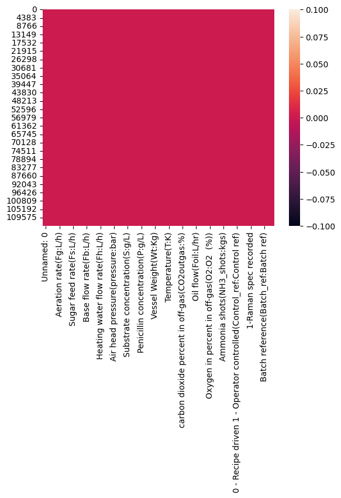
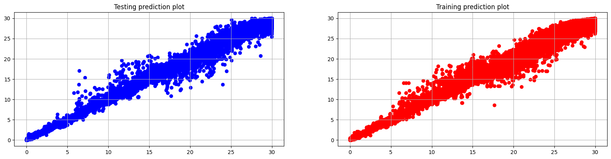

# Industrial Scale Penicillin Simulation

## Overview
This project aims to leverage the Industrial-scale Penicillin Simulation dataset to investigate and improve control strategies in large-scale fermentations. Our objectives include exploring the relationships between input parameters and their impacts on outcomes, identifying the batch achieving the highest penicillin concentration, and examining correlations between penicillin concentration and other variables. This study aims to advance bioprocess control and optimization in contemporary biopharmaceutical facilities.

## Dataset
The dataset used in this project is from Kaggle: [Big Data-Biopharmaceutical manufacturing](https://www.kaggle.com/datasets/stephengoldie/big-databiopharmaceutical-manufacturing/data).

Due to its size, the original dataset is 2.7GB and was compressed to 700MB for upload to GitHub. You can download the dataset from the above link.

## Installation
1. Clone the repository:
    ```sh
    git clone https://github.com/ansh-info/Industrial-Scale-Penicillin-Simulation.git
    ```
2. Navigate to the project directory:
    ```sh
    cd Industrial Scale Penicillin Simulation
    ```
3. Install the required packages:
    ```sh
    pip install -r requirements.txt
    ```
4. Download the original dataset from Kaggle and place it in the `data/` directory:
    - [Download Original Dataset](https://www.kaggle.com/datasets/stephengoldie/big-databiopharmaceutical-manufacturing/data)

## Usage
1. **Data Cleaning:**
    - Run the `1. Cleaning-Dataset.ipynb` notebook to clean the dataset and generate the final CSV file with 33 columns.
2. **Machine Learning Analysis:**
    - Run the `2. Regression-Penicillin Simulation.ipynb` notebook to perform the regression analysis and other machine learning tasks.

## Machine Learning Analysis
### Data Cleaning
The `1. Cleaning-Dataset.ipynb` notebook performs the following tasks:
- Loads the dataset from CSV.
- Handles missing values.
- Normalizes and scales features.
- Generates a cleaned dataset with 33 relevant columns.

### Regression Analysis
The `2. Regression-Penicillin Simulation.ipynb` notebook performs the following tasks:
- Loads the cleaned dataset.
- Performs exploratory data analysis (EDA).
- Identifies highly correlated variables with penicillin concentration.
- Develops regression models to predict penicillin concentration.
- Evaluates model performance using various metrics.

## Images
### Data Cleaning Process


### Regression Analysis


## Acknowledgements
We would like to thank the original dataset creator and Kaggle for providing the platform to share this data.

## Contact Information
For any queries or feedback, please contact [anshkumar.info@gmail.com].


